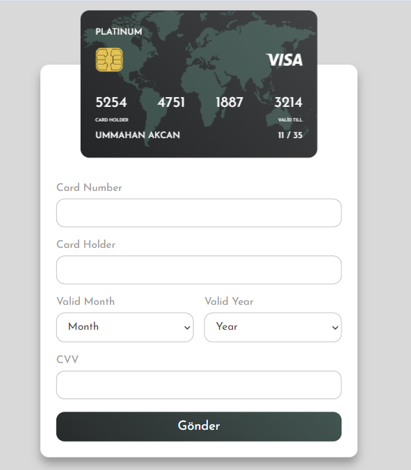

# Debit Card Project
[Demo](https://ummahanakcandebitcard.netlify.app/)

## Project Overview

- In this project, the code facilitates a credit card form, enabling real-time updates of the cardholder name, expiration date, and CVV.

- It also includes features for formatting and validating both the card number and CVV inputs.

